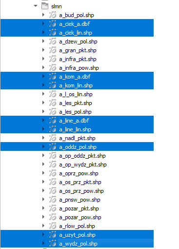
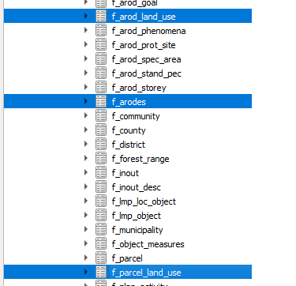
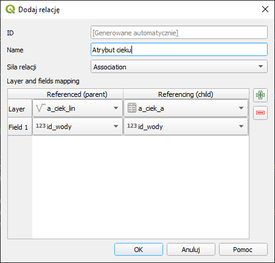
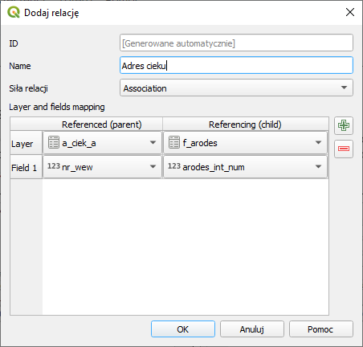
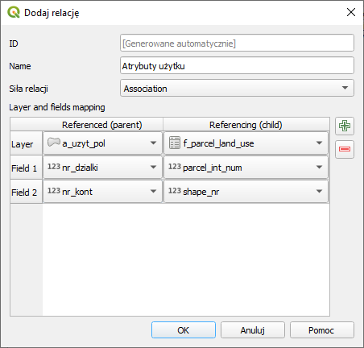

Model Wyliczanie Tyld wymaga wstępnego przygotowania projektu w programie QGIS. Ta instrukcja przeprowadzi cię przez ten proces.

# Otwarcie warstw SLMN

Otwórz warstwy ciek_a, ciek_lin, kom_a, kom_lin, line_a, line_lin, oddz_pol, wydz_pol, uzyt_pol w standardzie (SLMN).

# Otwarcie warstw SILP.db

Ze zbioru SILP.db (paczka mLas) wczytaj warstwy f_arodes, f_parcel_land_use, f_arod_land_use

# Utworzenie relacji i złączeń

Z menu projekt wybierz Właściwości projektu a nastepnie zakładkę Relacje. 
Następnie utwórz relacje dla powiązań linia - atrybut (cieki, linie, komunikacja) - 3x , 

atrybut - adres (do tabeli f_arodes) - 3x, oraz użytek - oznaczenie użytku

